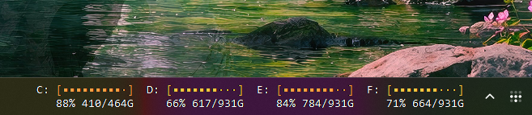

# Modules

Ready-to-use Taskband modules. Each folder is self-contained: a `module.json`
describing the module, plus whatever script it runs. Copy a folder into
`%USERPROFILE%\Taskband\modules\` and it shows up in the configurator.

| Module                          | Shows                                    | Needs                                       |
| ------------------------------- | ---------------------------------------- | ------------------------------------------- |
| [claude-usage](claude-usage/)   | Claude 5-hour and 7-day usage, with bars | Node.js 18+, a claude.ai cookie             |
| [clock](clock/)                 | Date over a ticking time                 | nothing                                     |
| [cpu](cpu/)                     | Processor load percentage                | nothing                                     |
| [disk-space](disk-space/)       | Usage bar for every fixed drive          | nothing                                     |
| [memory](memory/)               | Physical memory in use                   | nothing                                     |
| [mouse-battery](mouse-battery/) | Wireless mouse battery, off its receiver | Python 3.8+, an Attack Shark 2.4G receiver  |

On the taskbar, claude-usage, disk-space, and memory look like this:





Modules with setup worth explaining have their own README. `cpu` and `clock`
have no script at all: their `exec` is a single PowerShell command, so the
folder holds only a `module.json`.

## Wiring one up

Copy the module's folder into `%USERPROFILE%\Taskband\modules\`, then
right-click the tray icon, choose **Configure...**, and drag it from the
palette onto a monitor. Every folder here carries a `module.json`, which is
what puts it in the palette:

```json5
{
    // shown next to the module in the configurator palette
    "description": "Physical memory in use, bar colored by level",
    // ${dir} becomes this folder's real path when the module is added
    "exec": "powershell -NoProfile -ExecutionPolicy Bypass -File \"${dir}\\memory.ps1\" -Styled",
    "interval": 5,
    "output": "html",
    "css": { "font-family": "Consolas", "text-align": "left" }
}
```

Every key except `description` is copied into `config.json` as-is. To wire one
up by hand instead, add a definition to your `config.json`, list its name in
`modules`, and replace `${dir}` with the folder's real path:

```json5
{
    "modules": ["memory", "clock"],

    "memory": {
        "exec": "powershell -NoProfile -ExecutionPolicy Bypass -File \"C:\\Users\\you\\Taskband\\modules\\memory\\memory.ps1\"",
        "interval": 5
    }
}
```

## Things that catch people out

**Use absolute paths.** Taskband runs each `exec` through `cmd /C`, which
inherits whatever working directory `Taskband.exe` was started from. A relative
path works until you enable start-at-login, then silently stops. Adding a
module from the configurator handles this for you: `${dir}` in a `module.json`
is expanded to an absolute path when the module is written into `config.json`.

**Escape the path in JSON.** Backslashes double up (`C:\\path\\to`) and inner
quotes need a backslash (`\"`). JSON5 comments and trailing commas are fine, but
these two rules are not relaxed.

**Modules share one worker thread.** Taskband runs due modules one after another
on a single thread, so a slow module delays every other module for as long as it
takes. `claude-usage` waits up to five seconds for the network. Give slow
modules a generous `interval`, and keep in mind that a one-second `clock` will
not tick smoothly while a slow module is running.

**Use a monospace font for anything with bars or columns.** In a proportional
font, stacked bar lines will not align.

**A module is arbitrary shell code.** It runs as you, every interval, and
Taskband reloads `config.json` the moment it changes. Read a module before you
point Taskband at it.
